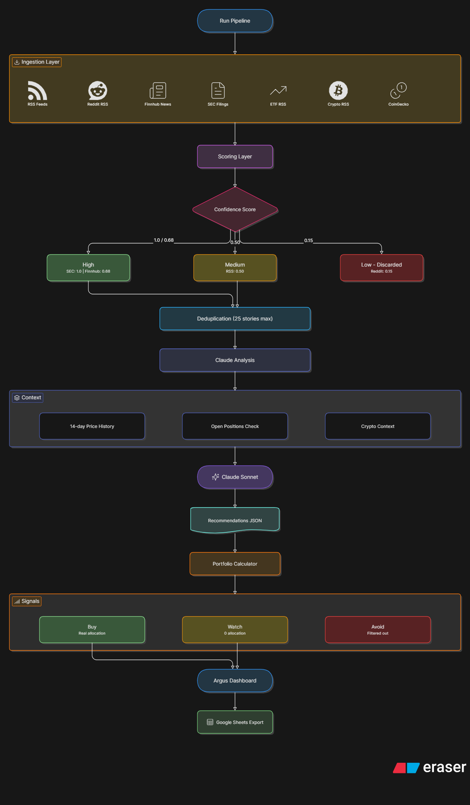
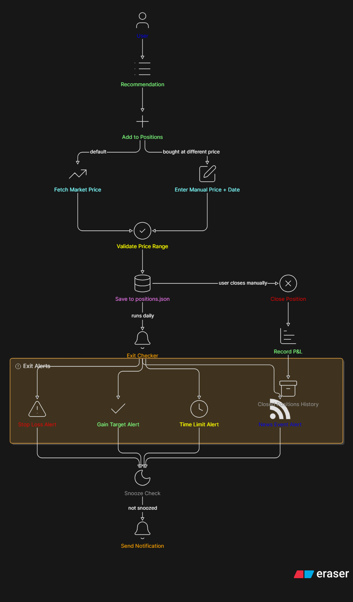
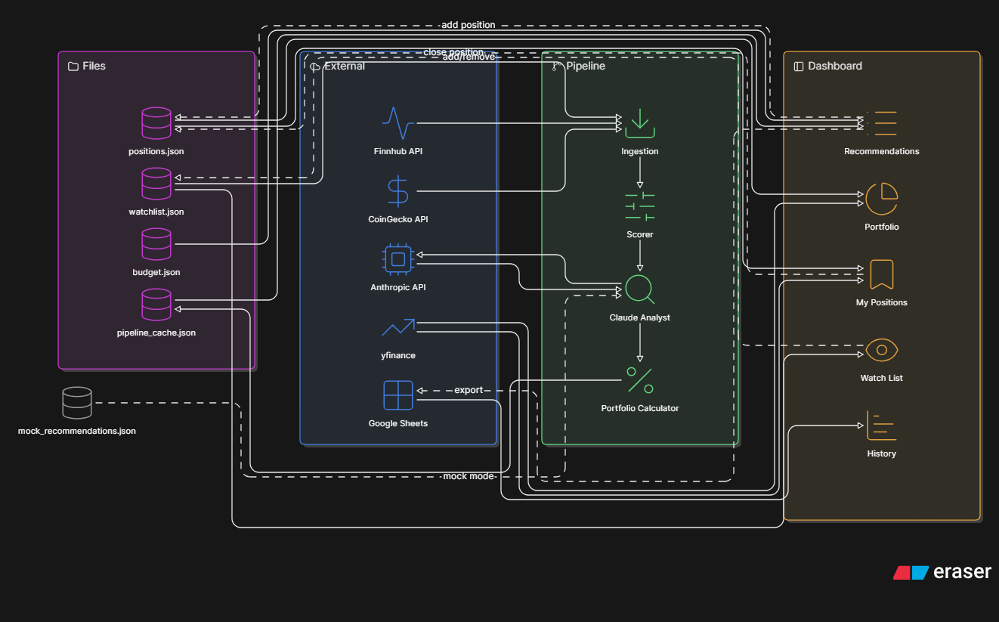

# 🔍 Argus

> AI-powered personal stock advisor. Fetches news from 8+ sources, scores credibility, sends top signals to Claude for analysis, and tracks your real positions with exit alerts.

**Not financial advice. Experimental tool. Start small.**

---

## What it does

Argus runs a daily pipeline that:

1. Fetches financial news in parallel from RSS feeds, Reddit, Finnhub, SEC filings, CoinGecko, and Robinhood
2. Scores each story by source credibility (SEC filings = 1.0, Reddit = 0.15)
3. Deduplicates and sends the top 25 stories to Claude Sonnet for analysis
4. Returns buy / watch / avoid signals with exit conditions and stop losses calibrated to 14-day price trends
5. Allocates your budget across buy signals only — watch signals show $0

You track positions, set exit conditions, and get email alerts when stop losses or gain targets are hit.

---

## Screenshots & Diagrams

### Pipeline Overview
How a pipeline run flows from news ingestion to recommendations.



### Position Lifecycle
How positions are added, tracked, alerted, and closed.



### Data Flow
How all components, files, and external APIs connect.



---

## Features

**Pipeline**
- 8+ parallel news sources: RSS, Reddit, Finnhub, SEC EDGAR, ETF RSS, Crypto RSS, CoinGecko, Robinhood
- Confidence scoring by source type — SEC filings get 1.0, Reddit gets 0.15
- Claude Sonnet analysis with 14-day price trend context
- Buy-only budget allocation — watch signals never get capital
- Open positions passed to Claude so it never recommends buying what you already own
- Mock mode (`MOCK_MODE=true`) skips the Claude API for zero-token testing

**Dashboard (5 tabs)**
- Today's Recommendations — allocation table, stock detail cards, add to positions
- Portfolio — real invested money, shares, combined value trend graph (like Robinhood)
- My Positions — open/closed positions, P&L, exit conditions, snooze alerts
- Watch List — manage tickers Finnhub monitors for company-specific news
- History — exported pipeline runs from Google Sheets with charts

**Positions**
- Add from recommendations with one click (uses live market price by default)
- Manual price + date entry if you bought at a different price
- Price validation warns if entry is >50% or <200% of market price
- Robinhood sync — one-click import of all your Robinhood positions with real cost basis
- Amount invested tracking for portfolio value calculation
- Close positions with P&L recorded automatically

**Exit Checker**
- Stop loss detection: `stop loss at 4%` triggers when position drops that far
- Gain target detection: `target 8% gain` triggers when position reaches it
- Time-based exits: `2 weeks`, `3 days`, `1 month`
- Event-based exits: Claude reads fresh news and checks if your exit condition was triggered
- Snooze alerts per ticker (1 day, 1 week, or permanently dismiss)
- Email notifications via Gmail SMTP

**Argus Assistant**
- Floating chat button (bottom-right) powered by Claude
- Investing topics only — will not answer unrelated questions
- Knows the full Argus feature set and can explain signals, confidence scores, and how to use any tab
- API key handled server-side via Flask proxy — never exposed in the browser

---

## Tech Stack

| Component | Technology |
|---|---|
| Dashboard | Streamlit |
| AI Analysis | Anthropic Claude Sonnet |
| News Sources | Finnhub, SEC EDGAR, Reddit RSS, CoinGecko, robin_stocks |
| Price Data | yfinance |
| Export | Google Sheets API (gspread) |
| Alerts | Gmail SMTP |
| Chatbot Proxy | Flask |

---

## Setup

### 1. Clone and install

```bash
git clone https://github.com/jaspherramos98/MyDentalPortal
cd stock-advisor
python -m venv venv
venv\Scripts\activate        # Windows
pip install -r requirements.txt
```

### 2. Configure `.env`

Copy `.env.example` to `.env` and fill in your keys:

```
ANTHROPIC_API_KEY=
FINNHUB_API_KEY=
GOOGLE_SHEET_ID=
GOOGLE_CREDENTIALS_FILE=google_credentials.json

ALERT_EMAIL_SENDER=
ALERT_EMAIL_PASSWORD=
ALERT_EMAIL_RECEIVER=

ROBINHOOD_USERNAME=
ROBINHOOD_PASSWORD=

MOCK_MODE=true
MOCK_INGESTION=true
```

Set `MOCK_MODE=false` and `MOCK_INGESTION=false` when ready for real analysis.

### 3. Google Sheets (optional)

Place your `google_credentials.json` service account file in the project root. The sheet ID goes in `.env`. Used for history export only — the app works without it.

### 4. Run

```bash
streamlit run dashboard/app.py
```

---

## Mock Mode

Set both flags in `.env` to test the full UI without consuming any API tokens:

```
MOCK_MODE=true
MOCK_INGESTION=true
```

A yellow banner appears at the top of the dashboard when mock mode is active. Edit `mock_recommendations.json` to customize the test data.

---

## Project Structure

```
stock-advisor/
├── dashboard/app.py          # Streamlit UI — all 5 tabs + chatbot
├── main.py                   # Pipeline orchestration (parallel ingestion)
├── analysis/
│   └── claude_analyst.py     # Claude API integration + prompt building
├── ingestion/
│   ├── rss.py                # RSS feed ingestion
│   ├── reddit.py             # Reddit RSS
│   ├── finnhub_news.py       # Finnhub market + company news
│   ├── sec.py                # SEC EDGAR filings
│   ├── coingecko.py          # Crypto context + white papers
│   ├── crypto_news.py        # CoinDesk, CoinTelegraph, Decrypt RSS
│   ├── etf_news.py           # ETF-specific RSS feeds
│   ├── prices.py             # Live prices (Finnhub) + 14-day history (yfinance)
│   └── robinhood.py          # Read-only Robinhood sync (robin_stocks)
├── validation/
│   └── scorer.py             # Confidence scoring by source type
├── calculator/
│   └── portfolio.py          # Budget allocation (buy signals only)
├── storage/
│   ├── positions.py          # Position CRUD + P&L tracking
│   ├── sheets.py             # Google Sheets export
│   └── watchlist.py          # Watchlist management
├── alerts/
│   ├── exit_checker.py       # Stop loss, gain, time, and event-based checks
│   ├── notifier.py           # Email alerts
│   ├── run_checks.py         # Scheduled check runner
│   └── snooze.py             # Per-ticker alert snooze
├── mock_recommendations.json # Test data for mock mode
├── .env.example              # Environment variable template
└── docs/                     # Architecture diagrams
    ├── pipeline-overview.png
    ├── position-lifecycle.png
    └── data-flow.png
```

---

## Confidence Score Reference

| Source | Score | Notes |
|---|---|---|
| SEC filings (8-K, 10-Q) | 1.0 | Verified official filings |
| Finnhub company news | 0.7 | Aggregated financial news |
| Finnhub general news | 0.68 | Market-wide news |
| Robinhood news | 0.65 | Curated per-ticker news |
| RSS feeds | 0.50 | Major financial outlets |
| ETF RSS | 0.50 | ETF-specific outlets |
| Crypto RSS | 0.45 | Crypto-specific outlets |
| Reddit RSS | 0.15 | Community posts — lowest trust |

Stories scoring below 0.50 are discarded before Claude sees them.

---

## Exit Condition Format

Claude generates exit conditions in plain English. The exit checker parses them automatically:

```
target 8% gain, stop loss at 3%
post-earnings reaction or 2 weeks, stop loss at 5%
merger completion or deal termination announcement
target 5% gain on rate clarity, stop loss at 2%
```

The checker handles:
- `stop loss at X%` — triggers when position drops X%
- `target X% gain` — triggers when position gains X%
- `X weeks / X days / X months` — triggers after that time from entry date
- Any event phrase — Claude reads fresh news daily to check if the event occurred

---

## API Keys Required

| Key | Where to get it | Required |
|---|---|---|
| `ANTHROPIC_API_KEY` | console.anthropic.com | Yes |
| `FINNHUB_API_KEY` | finnhub.io (free tier) | Yes |
| `GOOGLE_SHEET_ID` + credentials | Google Cloud Console | Optional |
| Gmail app password | Google Account → Security | Optional |
| Robinhood credentials | Your Robinhood account | Optional |

---

## Important Notes

- This tool is for **personal, informational use only**
- It is **not financial advice**
- Past signals do not predict future performance
- The Robinhood sync uses `robin_stocks`, an unofficial library — it may break if Robinhood changes their app. All Robinhood API calls are isolated in `ingestion/robinhood.py` for easy updates
- Never commit `.env` or `google_credentials.json` to version control
