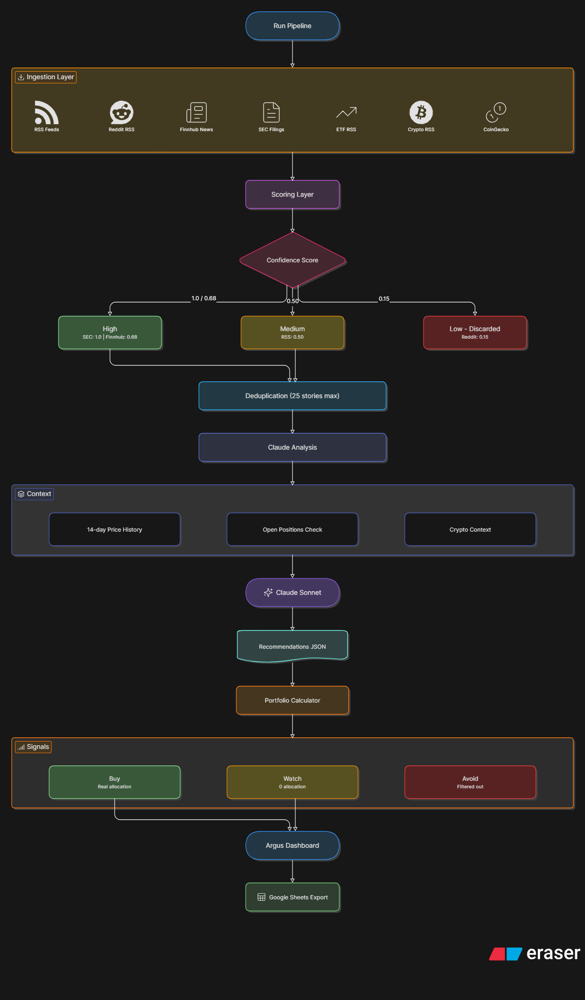
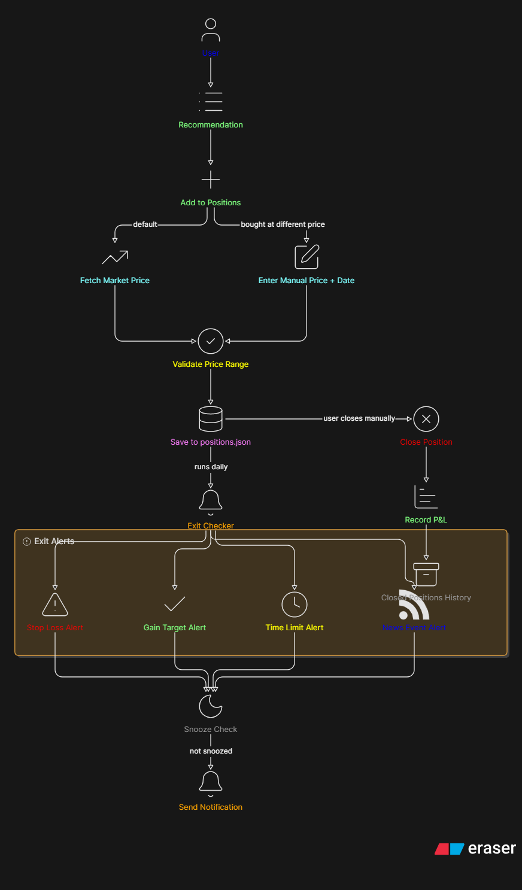
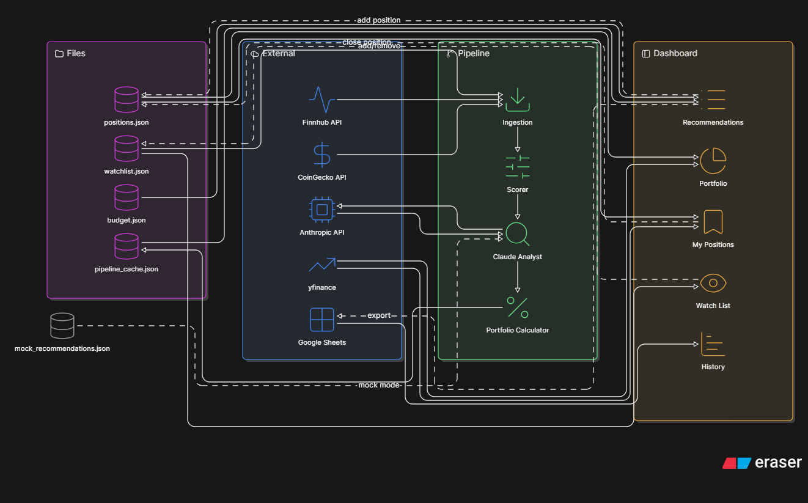

# 🔍 Argus

> AI-powered personal stock advisor. Fetches news from 8+ sources, scores credibility, sends top signals to Claude for analysis, and tracks your real positions with exit alerts.

**Not financial advice. Experimental tool. Start small.**

---

## What it does

Argus runs a daily pipeline that:

1. Fetches financial news in parallel from RSS feeds, Reddit, Finnhub, SEC filings, CoinGecko, and Robinhood
2. Scores each story by source credibility (SEC filings = 1.0, Reddit = 0.15)
3. Deduplicates and sends the top 15 stories to Claude Sonnet for analysis
4. Returns buy / watch / avoid signals with exit conditions and stop losses calibrated to 14-day price trends
5. Allocates your budget across buy signals only — watch signals show $0

You track positions, set exit conditions, and get email alerts when stop losses or gain targets are hit.

---

## Screenshots & Diagrams

### Pipeline Overview
How a pipeline run flows from news ingestion to recommendations.



### Position Lifecycle
How positions are added, tracked, alerted, and closed.



### Data Flow
How all components, files, and external APIs connect.



---

## Features

**Pipeline**
- 8+ parallel news sources: RSS, Reddit, Finnhub, SEC EDGAR, ETF RSS, Crypto RSS, CoinGecko, Robinhood
- Confidence scoring by source type — SEC filings get 1.0, Reddit gets 0.15
- Claude Sonnet analysis with 14-day price trend context
- Buy-only budget allocation — watch signals never get capital
- Open positions passed to Claude so it never recommends buying what you already own
- Mock mode (`MOCK_MODE=true`) skips the Claude API for zero-token testing

**Dashboard (6 tabs)** — each tab is its own module in `dashboard/tabs/`
- Today's Recommendations — allocation table, stock detail cards, batch "watch this trigger", add to positions
- Portfolio — real invested money, shares, combined value trend graph (like Robinhood)
- My Positions — open/closed positions, P&L, structure-anchored suggested exits, performance scorecard, snooze
- Watch List — what Argus monitors (exit alerts, pinned buy triggers with 1-day expiry) + ticker watchlist
- History — exported pipeline runs from Google Sheets with charts
- 🤖 Agent — observe/control the autonomous options agent: paper book, live candlestick with buy/sell
  markers, LLM credit ledger, Off/Paper/Live mode, preview/live cycles, positions + Close-now

**Autonomous agent** (isolated Robinhood Agentic account, disposable pilot money)
- One control: agent mode Off / Paper / Live (Agent tab); defaults to Paper — never real money unless you pick Live
- Trades long calls/puts through 5 codified strategies, plus shares for moderate-conviction buys (capped)
- Trailing take-profit exits, anti-churn, LLM-credit halt, PDT guard; a Sonnet judge reviews every call in shadow mode

**Positions**
- Add from recommendations with one click (uses live market price by default)
- Manual price + date entry if you bought at a different price
- Price validation warns if entry is >50% or <200% of market price
- Robinhood sync — import your positions with real cost basis (via the official Trading MCP)
- Amount invested tracking for portfolio value calculation
- Close positions with P&L recorded automatically

**Exit Checker**
- Stop loss detection: `stop loss at 4%` triggers when position drops that far
- Gain target detection: `target 8% gain` triggers when position reaches it
- Time-based exits: `2 weeks`, `3 days`, `1 month`
- Event-based exits: Claude reads fresh news and checks if your exit condition was triggered
- Snooze alerts per ticker (1 day, 1 week, or permanently dismiss)
- Buy-trigger ("buy when") alerts for pinned watches, Argus chat ideas, and fresh watchlisted recommendations
- Email notifications via Gmail SMTP

**Argus Assistant**
- Floating chat button (bottom-right) powered by Claude
- Investing topics only — will not answer unrelated questions
- Knows the full Argus feature set and can explain signals, confidence scores, and how to use any tab
- API key handled server-side via Flask proxy — never exposed in the browser

---

## Tech Stack

| Component | Technology |
|---|---|
| Dashboard | Streamlit |
| AI Analysis | Anthropic Claude Sonnet |
| News Sources | Finnhub, SEC EDGAR, Reddit RSS, CoinGecko |
| Brokerage | Robinhood official Trading MCP (OAuth; reads + agentic orders), `robin_stocks` fallback |
| Price Data | Robinhood quotes, yfinance (history + fallback) |
| Export | Google Sheets API (gspread) |
| Alerts | Gmail SMTP |
| Chatbot Proxy | Flask |

---

## Setup

### 1. Clone and install

```bash
git clone https://github.com/jaspherramos98/Mstock-advisor
cd stock-advisor
python -m venv venv
venv\Scripts\activate        # Windows
pip install -r requirements.txt
```

### 2. Configure `.env`

Copy `.env.example` to `.env` and fill in your keys:

```
ANTHROPIC_API_KEY=
FINNHUB_API_KEY=
GOOGLE_SHEET_ID=
GOOGLE_CREDENTIALS_FILE=google_credentials.json

ALERT_EMAIL_SENDER=
ALERT_EMAIL_PASSWORD=
ALERT_EMAIL_RECEIVER=

ROBINHOOD_USERNAME=
ROBINHOOD_PASSWORD=

MOCK_MODE=true
MOCK_INGESTION=true
```

Set `MOCK_MODE=false` and `MOCK_INGESTION=false` when ready for real analysis.

### 3. Google Sheets (optional)

Place your `google_credentials.json` service account file in the project root. The sheet ID goes in `.env`. Used for history export only — the app works without it.

### 4. Run

```bash
streamlit run dashboard/app.py
```

---

## Mock Mode

Set both flags in `.env` to test the full UI without consuming any API tokens:

```
MOCK_MODE=true
MOCK_INGESTION=true
```

A yellow banner appears at the top of the dashboard when mock mode is active. Edit `mock_recommendations.json` to customize the test data.

---

## Project Structure

```
stock-advisor/
├── dashboard/
│   ├── app.py                # Streamlit shell: header, sidebar, pipeline run, chat proxy, tab wiring
│   ├── common.py             # Cached network readers + shared render helpers
│   └── tabs/                 # One module per tab (recommendations, portfolio, positions,
│                             #   watchlist, history, agent) — each exposes render()
├── main.py                   # Pipeline orchestration (parallel ingestion)
├── config.py                 # Model names + MCP / DRY_RUN / persistent-session flags
├── trading_guards.py         # Order-safety guardrails (idempotency, caps, kill switch)
├── llm_budget.py             # Local Claude credit ledger (halts agent + chat at reserve)
├── market_hours.py           # NYSE session logic (holidays, half days)
├── analysis/
│   ├── claude_analyst.py     # Claude API integration + prompt building
│   ├── scorecard.py          # Closed-trade performance scorecard
│   └── options_strategies.py # Agent strategy library + exit policy
├── ingestion/
│   ├── rss.py, reddit.py, finnhub_news.py, sec.py, crypto_news.py, etf_news.py  # news sources
│   ├── coingecko.py          # Crypto context + market data
│   ├── prices.py             # Quotes, technicals, key levels, market regime
│   ├── fundamentals.py, etf_facts.py   # Company / ETF facts
│   ├── account_reads.py      # Read dispatcher: Robinhood MCP or robin_stocks
│   ├── robinhood_mcp.py      # Official Trading MCP client (reads + guarded orders)
│   ├── mcp_auth.py           # OAuth transport (silent refresh, never pops a browser on reads)
│   ├── mcp_session.py        # One persistent MCP connection per process
│   ├── options_data.py, signal_context.py, affordable_scout.py   # agent inputs
│   └── robinhood.py          # robin_stocks fallback (unofficial)
├── validation/scorer.py      # Confidence scoring by source type
├── calculator/portfolio.py   # Pyramid budget allocation
├── storage/                  # positions, watchlist, sheets, entry_watch, paper_book, peak_tracker
├── alerts/
│   ├── exit_checker.py, entry_checker.py   # Sell / buy-trigger checks
│   ├── notifier.py, run_checks.py, snooze.py
│   ├── agentic_options.py    # Autonomous options agent (entries + exits)
│   └── agentic_stops.py      # Standing GTC stops for agent share positions (for planned stock trading)
├── scripts/                  # run_agent, agentic_options, close_all_agent, mcp_login,
│                             #   scan_affordable, bench_dashboard, agentic_stops
├── tests/test_deterministic.py   # Network-free unit tests (CI)
├── mock_recommendations.json # Test data for mock mode
└── docs/                     # Architecture diagrams
```

---

## Confidence Score Reference

| Source | Score | Notes |
|---|---|---|
| SEC filings (8-K, 10-Q) | 1.0 | Verified official filings |
| Finnhub company news | 0.7 | Aggregated financial news |
| Finnhub general news | 0.68 | Market-wide news |
| Robinhood news | 0.65 | Curated per-ticker news |
| RSS feeds | 0.50 | Major financial outlets |
| ETF RSS | 0.50 | ETF-specific outlets |
| Crypto RSS | 0.45 | Crypto-specific outlets |
| Reddit RSS | 0.15 | Community posts — lowest trust |

Stories scoring below 0.50 are discarded before Claude sees them.

---

## Exit Condition Format

Claude generates exit conditions in plain English. The exit checker parses them automatically:

```
target 8% gain, stop loss at 3%
post-earnings reaction or 2 weeks, stop loss at 5%
merger completion or deal termination announcement
target 5% gain on rate clarity, stop loss at 2%
```

The checker handles:
- `stop loss at X%` — triggers when position drops X%
- `target X% gain` — triggers when position gains X%
- `X weeks / X days / X months` — triggers after that time from entry date
- Any event phrase — Claude reads fresh news daily to check if the event occurred

---

## API Keys Required

| Key | Where to get it | Required |
|---|---|---|
| `ANTHROPIC_API_KEY` | console.anthropic.com | Yes |
| `FINNHUB_API_KEY` | finnhub.io (free tier) | Yes |
| `GOOGLE_SHEET_ID` + credentials | Google Cloud Console | Optional |
| Gmail app password | Google Account → Security | Optional |
| Robinhood credentials | Your Robinhood account | Optional |

---

## Important Notes

- This tool is for **personal, informational use only**
- It is **not financial advice**
- Past signals do not predict future performance
- Account reads and the agent's orders use Robinhood's **official Trading MCP** (OAuth). Orders only ever go to the dedicated Agentic account, are gated by `DRY_RUN` + an explicit arm file, and never touch your main account
- `robin_stocks` (unofficial) remains as a fallback (`config.USE_MCP=False`) and may break if Robinhood changes their app; it is isolated in `ingestion/robinhood.py`
- Never commit `.env` or `google_credentials.json` to version control
